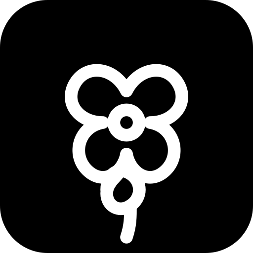
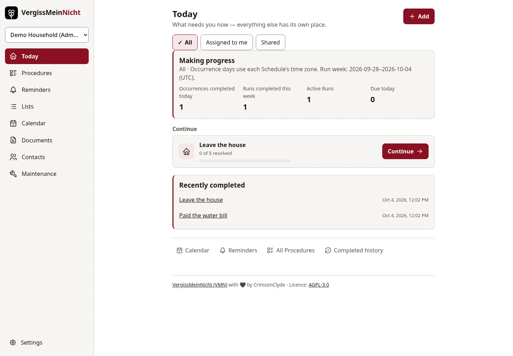
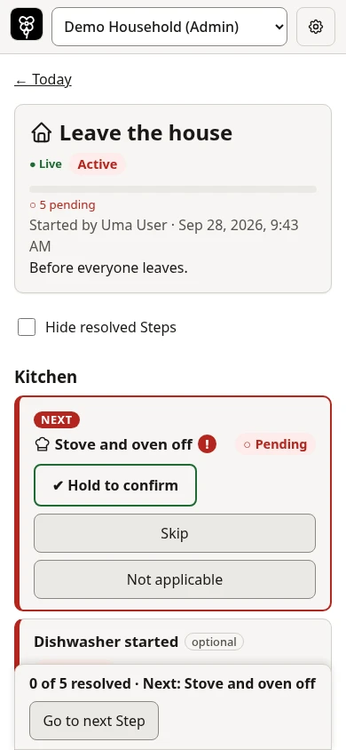
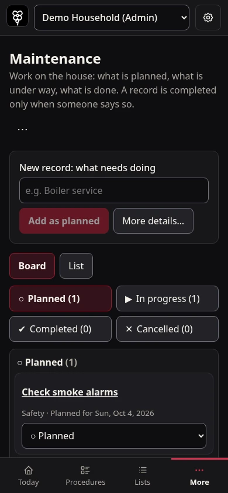

  

<h1 align="center">VergissMeinNicht</h1>

  
  

  <a href="#screenshots">Screenshots</a> ·
  <a href="#documentation">Documentation</a> ·
  <a href="#project-status">Project status</a>

**Two households, both alike in dignity.\
And both convinced someone else turned off the water.**

In fair **VergissMeinNicht**, where we lay our lists, forgotten chores need not become a tragedy.

**VergissMeinNicht (VMN)** helps you keep everyday life in order—at home, at your holiday flat, or wherever people share responsibilities. Remember what needs doing, make leaving the house less of a guessing game, and spare yourselves another round of “I thought you’d done that.”

Turn familiar routines into reusable **Procedures**, work through them together, and schedule recurring obligations. Keep shopping lists, documents, contacts and maintenance alongside them. Each shared **Workspace** is yours to shape: switch every tool on or off and keep only what you need.

Clear actions, manageable steps and easy undo keep things moving. Completed **Runs** remember what was done, by whom and when—even after the original Procedure changes.

Self-hosted and open source, with Light and Dark themes on phones and desktops. For one household, two households, or a whole team with unfinished business.

**Less household drama. More getting things done.**

## Made for everyday life

- **At home:** share the weekly chores so everyone can see what still needs doing.
- **At a holiday home:** follow an arrival or departure routine for the water, heating and locks.
- **With a team:** reuse a handover routine and see who completed each step.

Workspace admins choose which tools to enable. New Workspaces start with all functional tools off; disabling a tool keeps its data for when you need it again.

## Screenshots

Real app captures from a fictional demo Workspace, in Light and Dark themes.

  

**Today · desktop, Light:** see recent progress and pick up an unfinished routine.

  
  

- **Run execution · phone, Light:** follow the next step, with deliberate confirmation for critical checks.
- **Maintenance · phone, Dark:** keep planned work in view and update its status as you go.

[Capture details and additional views](assets/screenshots/workspace-tools-2026-10-04/README.md), including the Procedure builder, Documents and phone Today.

## Documentation

| I want to… | Start here |
|---|---|
| Use VMN | [User documentation](docs/user/README.md) |
| Install, configure or maintain an instance | [Admin documentation](docs/admin/README.md) |
| Contribute or develop locally | [Development documentation](docs/development/README.md) |
| Check planned work and known limitations | [Project steps](docs/development/steps.md) |
| Review security policies | [Security policy](docs/development/security.md) |

Browse all guides in the [documentation index](docs/README.md).

## Project status

**VMN is in beta.**

- **Available today:** reusable Procedures and collaborative Runs with history; scheduling, email and optional Telegram reminders; grocery Lists and Calendar; Documents, Contacts, Maintenance and Equipment. Today brings together work to do, progress and recent completions.
- **Planned:** text recognition for Documents and a Mail tool for connected mailboxes.

See the [implementation ledger](docs/development/steps.md) for release details, known limitations and upcoming work.

## The name

*Vergissmeinnicht* is German for the **forget-me-not** flower — literally “forget me not.” Say it like **fair-GISS-mine-nikht**. The knotted stem in the logo is a **Forget-Me-Knot**, like a string tied around a finger as a reminder.

## License

Made with 🖤 by CrimsonClyde. Licensed under [GNU AGPL v3](LICENSE) (`AGPL-3.0-only`). If you run a modified version for others over a network, offer its source code; configuration is covered in the [admin guide](docs/admin/deployment.md).

Bundled third-party software, including [Tabler Icons](https://tabler.io/icons) (MIT), is listed with its license texts at `/third-party-notices.txt` in each running instance.
